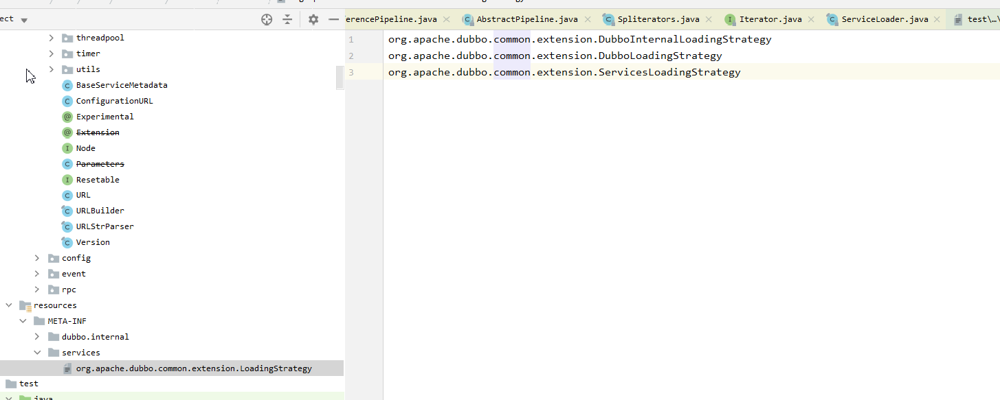

### SPI

#### 微内核架构
微内核架构中，内核通常采用Factory、IOC、OSGI等方式管理插件生命周期。

Dubbo才用SPI机制来加载插件。

#### JDK SPI

常见于Java的JDBC Driver。 

将具体的实现类放在ClassPath下的META-INF/services 目录下。

#### Dubbo SPI

Dubbo对配置文件进行了分类：
1. META-INF/services/ 目录： 兼容JDK SPI。
1. META-INF/dubbo/ 目录： 该目录用于存放用户自定义SPI配置文件。
1. META-INF/dubbo/internal/ 目录：用于存放Dubbo内部使用的SPI配置文件。

并且将配置文件改成了KV格式。 
其中key被称为扩展名，当我们在为一个接口寻找具体实现类时，可以指定扩展名来选择相应的扩展实现。    
这样就只需要实例化这一个扩展即可，无需实例化SPI配置文件中的其他扩展实现类。

#### @SPI

被@SPI修饰的接口， 就代表这个接口是扩展接口。   
@SPI注解中的value值，指定了默认的扩展名称。

#### ExtensionLoader如何处理SPI注解

#### 如何获取Dubbo对配置文件进行的分类
使用Java原生

