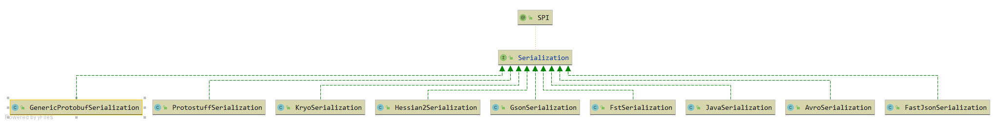
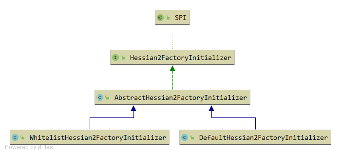

## Serialization


### 类图

#### Seriallization


#### Hessian2FactoryInitializer


### 实现

#### Hessian2Serialization
```java
public class Hessian2Serialization implements Serialization {

    @Override
    public byte getContentTypeId() {
        return HESSIAN2_SERIALIZATION_ID;
    }
    @Override
    public String getContentType() {
        return "x-application/hessian2";
    }
    @Override
    public ObjectOutput serialize(URL url, OutputStream out) throws IOException {
        return new Hessian2ObjectOutput(out);  // 创建Hessian2ObjectOutput,  将基本类型和对象写入到输出流
    }
    @Override
    public ObjectInput deserialize(URL url, InputStream is) throws IOException {
        return new Hessian2ObjectInput(is);    // 创建Hessian2ObjectInput,  从输入流中读取数据，转换为基本类型和对象
    }
}
```

Hessian2ObjectOutput和Hessian2ObjectInput 主要是使用 Dubbo自己实现的 Hessian-lite 完成 对象的序列化和数据的反序列化。


#### Hessian2FactoryInitializer
```java
@SPI("default")
public interface Hessian2FactoryInitializer {
    String WHITELIST = "dubbo.application.hessian2.whitelist";
    String ALLOW = "dubbo.application.hessian2.allow";
    String DENY = "dubbo.application.hessian2.deny";
    ExtensionLoader<Hessian2FactoryInitializer> loader = ExtensionLoader.getExtensionLoader(Hessian2FactoryInitializer.class);

    SerializerFactory getSerializerFactory();

    static Hessian2FactoryInitializer getInstance() {
        String whitelist = ConfigurationUtils.getProperty(WHITELIST);
        if (StringUtils.isNotEmpty(whitelist)) {
            return loader.getExtension("whitelist");           // 使用SPI 加载 WhitelistHessian2FactoryInitializer
        }
        return loader.getDefaultExtension();                  // 默认加载 DefaultHessian2FactoryInitializer
    }
}
```


#### WhitelistHessian2FactoryInitializer    
Hessian 白名单和黑名单机制。 防止反序列化漏洞。    
见： 
1. http://rui0.cn/archives/1338
2. https://www.freebuf.com/vuls/170344.html
3. https://www.cnblogs.com/ssooking/p/5875215.html#autoid-0-0-0            :  在 java version "1.8.0_251" 中  AnnotationInvocationHandler 的漏洞已经修复，不再通过setValue进行赋值，而是直接通过更改引用的对象完成赋值。
```java
public class WhitelistHessian2FactoryInitializer extends AbstractHessian2FactoryInitializer {

    @Override
    public SerializerFactory createSerializerFactory() {
        SerializerFactory serializerFactory = new Hessian2SerializerFactory();
        String whiteList = ConfigurationUtils.getProperty(WHITELIST);
        if ("true".equals(whiteList)) {  // 白名单
            /**
             * -Ddubbo.application.hessian2.whitelist=true
             * -Ddubbo.application.hessian2.allow="org.apache.dubbo.demo.*"
             */
            serializerFactory.getClassFactory().setWhitelist(true);
            String allowPattern = ConfigurationUtils.getProperty(ALLOW);
            if (StringUtils.isNotEmpty(allowPattern)) {
                serializerFactory.getClassFactory().allow(allowPattern);
            }
        } else {                       // 黑名单
            /**
             * -Ddubbo.application.hessian2.whitelist=false
             * -Ddubbo.application.hessian2.deny="org.malicious.code.*"
             */
            serializerFactory.getClassFactory().setWhitelist(false);
            String denyPattern = ConfigurationUtils.getProperty(DENY);
            if (StringUtils.isNotEmpty(denyPattern)) {
                serializerFactory.getClassFactory().deny(denyPattern);
            }
        }
        return serializerFactory;
    }
}
```