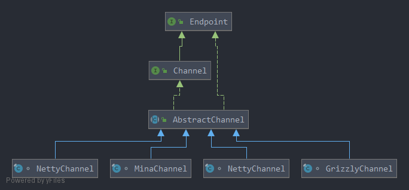
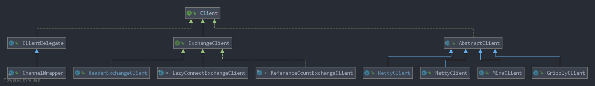
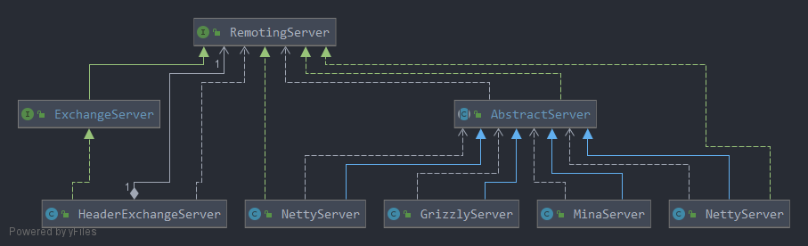

## Remoting


### Channel
Channel代表了一个打开的连接， 继承了Endpoint, 拥有了发送数据和关闭连接的能力。



### ChannelHandler
ChannelHandler是注册在Channel上的消息处理器。

### Client 和 RemotingServer
* Client:   客户端
* RemotingServer:    服务端

两者都继承了Endpoint, 具备发送消息的能力。

Client只关联一个Channel，RemotingServer关联了多个Channel， 即一个客户端只能和一个服务端建立连接，而一个服务端可以绑定多个客户端的连接。

#### Client类图


#### AbstractClient
AbstractClient定义了大部分的逻辑， 例如：发送消息时发现连接断开， 进行重新连接， 例如connect时加锁，避免多线程造成建立多条连接。
而具体的与服务端建立连接、断开连接交给子类实现。子类需要实现下面的模板方法。
```java
// Open client.
protected abstract void doOpen() throws Throwable;

// Close client.
protected abstract void doClose() throws Throwable;

// Connect to server.
protected abstract void doConnect() throws Throwable;

// disConnect to server.
protected abstract void doDisConnect() throws Throwable;

// Get the connected channel.
protected abstract Channel getChannel();
```

#### RemotingServer类图


#### AbstractServer
AbstractServer的子类需要下面两个模板方法。
```java
protected abstract void doOpen() throws Throwable;

protected abstract void doClose() throws Throwable;
```


#### 总结
Client 和 RemotingServer抽象了客户端和服务端的功能，需要进行网络通信方面的能力交给子类如Netty去实现。    
又如： Client 和 RemotingServer的send, 调用的其实是由 子类如Netty返回的Channel。 


### Transport
```java
@SPI("netty")
public interface Transporter {
    
    // Bind a server.
    @Adaptive({Constants.SERVER_KEY, Constants.TRANSPORTER_KEY})
    RemotingServer bind(URL url, ChannelHandler handler) throws RemotingException;

    // Connect to a server.
    @Adaptive({Constants.CLIENT_KEY, Constants.TRANSPORTER_KEY})
    Client connect(URL url, ChannelHandler handler) throws RemotingException;
}
```
Transporters 是 Transporter的门面， 由Transporters创建Client和RemotingServer。 而创建出来的Client和RemotingServer的真正的类型由 Transporter的SPI 决定。 如默认实现类为NettyTransporter。


NettyTransporter创建的Client和RemotingServer 为 NettyClient  和  NettyServer。 


```java
public class Transporters {
    public static RemotingServer bind(String url, ChannelHandler... handler) throws RemotingException {
        return bind(URL.valueOf(url), handler);
    }

    public static RemotingServer bind(URL url, ChannelHandler... handlers) throws RemotingException {
        ChannelHandler handler;
        if (handlers.length == 1) {
            handler = handlers[0];
        } else {
            handler = new ChannelHandlerDispatcher(handlers);
        }
        return getTransporter().bind(url, handler);    // 监听地址。
    }

    public static Client connect(String url, ChannelHandler... handler) throws RemotingException {
        return connect(URL.valueOf(url), handler);
    }

    public static Client connect(URL url, ChannelHandler... handlers) throws RemotingException {
        ChannelHandler handler;
        if (handlers == null || handlers.length == 0) {
            handler = new ChannelHandlerAdapter();
        } else if (handlers.length == 1) {
            handler = handlers[0];
        } else {
            handler = new ChannelHandlerDispatcher(handlers);
        }
        return getTransporter().connect(url, handler);  // 连接某个地址
    }
    public static Transporter getTransporter() {
        return ExtensionLoader.getExtensionLoader(Transporter.class).getAdaptiveExtension();
    }

}
```
```java
public class NettyTransporter implements Transporter {

    public static final String NAME = "netty";
    @Override
    public RemotingServer bind(URL url, ChannelHandler handler) throws RemotingException {
        return new NettyServer(url, handler);
    }
    @Override
    public Client connect(URL url, ChannelHandler handler) throws RemotingException {
        return new NettyClient(url, handler);
    }
}
```


### Exchanger

Exchanger创建Client和RemotingServer的流程如下： 

```
Exchangers --> Exchanger --> HeaderExchanger.bind     ->  HeaderExchangeServer  ->  Transporters.bind     ->  Transporter  -->  NettyTransporter.bind     -> NettyServer
Exchangers --> Exchanger --> HeaderExchanger.connect  ->  HeaderExchangeClient  ->  Transporters.connect  ->  Transporter  -->  NettyTransporter.connect  -> NettyClient
```

就这样一层层的获得了NettyServer和NettyClient。  
并且我们看到在HeaderExchanger中对传递进来的 ChannelHandler 进行了两次包装。   
最外层为DecodeHandler， 然后是HeaderExchangeHandler, 最后是传递进来的handler
```java
public class HeaderExchanger implements Exchanger {

    public static final String NAME = "header";

    @Override
    public ExchangeClient connect(URL url, ExchangeHandler handler) throws RemotingException {
        // ExChange 委托 Transport 进行通信
        return new HeaderExchangeClient(Transporters.connect(url, new DecodeHandler(new HeaderExchangeHandler(handler))), true);
    }
    @Override
    public ExchangeServer bind(URL url, ExchangeHandler handler) throws RemotingException {
        // ExChange 委托 Transport 进行通信
        return new HeaderExchangeServer(Transporters.bind(url, new DecodeHandler(new HeaderExchangeHandler(handler))));
    }
}
```

在NettyClient 和 NettyServer 的构造函数中 又会将传递进来的handler进行包装。  
这里拿NettyClient举例。
```java
public NettyClient(final URL url, final ChannelHandler handler) throws RemotingException {
    super(url, wrapChannelHandler(url, handler));
}
protected static ChannelHandler wrapChannelHandler(URL url, ChannelHandler handler) {
    return ChannelHandlers.wrap(handler, url);
}
protected ChannelHandler wrapInternal(ChannelHandler handler, URL url) {
    // MultiMessageHandler -> HeartbeatHandler -> handler
    return new MultiMessageHandler(new HeartbeatHandler(ExtensionLoader.getExtensionLoader(Dispatcher.class)
            .getAdaptiveExtension().dispatch(handler, url)));
}
```
这里又使用 MultiMessageHandler 最外层包装， 然后是HeartbeatHandler包装， 
再是 Dispatch对应的Handler，如AllDispatcher对应的是AllChannelHandler， 最后是传递进来的Handler。


结合上面两个地方对Handler的包装， 最后的包装结果为： 

MultiMessageHandler  ->  HeartbeatHandler  ->  Dispatch对应的Handler  ->  DecodeHandler  ->  HeaderExchangeHandler  ->  传递进来的handler