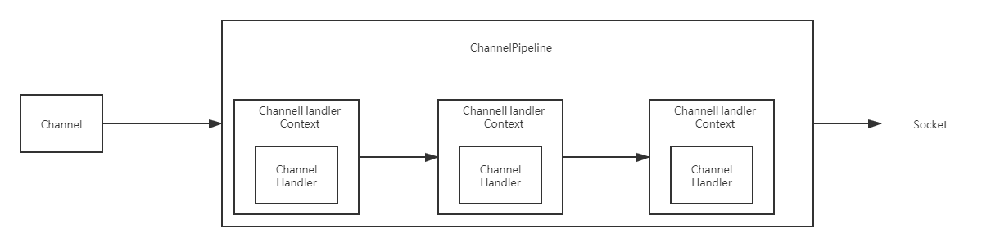
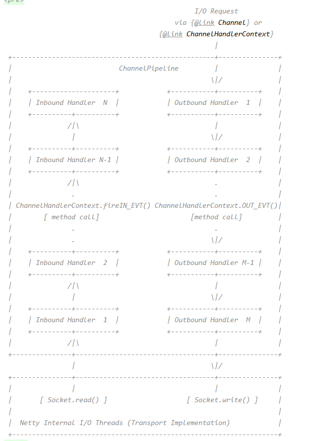

## Netty

### Channel

下面这段话是Jdk中对Channel的描述。 
> A nexus for I/O operations.    
> A channel represents an open connection to an entity such as a hardware device, a file, a network socket, 
> or a program component that is capable of performing one or more distinct I/O operations, for example reading or writing.     
> IO操作的连接器。    
> channel代表了一个与物体打开的连接。例如，一个硬件设备、文件、网络连接或者一个可以处理一个或多个不同IO操作的程序。例如写和写。      

Channel提供了基本的 API 用于网络 I/O 操作，如 bind、connect、read、write、flush等，屏蔽了底层Socket的复杂性，使用Channel就不需要与Socket打交道了。
### ChannelHandler （责任链模式）
下面这段话是Netty对ChannelHandler的描述。
> Handles an I/O event or intercepts an I/O operation, and forwards it to its next handler in its ChannelPipeline.   
> 处理一个IO事件， 或者拦截一个IO操作， 并且将它重定向到ChannelPipeline中它的下一个 handler.

简单理解， 当我们发送数据时，这是一个IO operation, 发送完毕后，Netty会发送一个Event告知我们，数据已经发送完毕了。   
在数据从我们手中被write出去，这时候对我们来说，数据已经发送出去了，但是在真正发送出去之前，还要经过ChannelHandler进行处理。    
等所有的ChannelHandler都对发送的数据进行处理完毕后，最后经由Socket发送出去。

#### ChannelHandlerContext
用于保存ChannelHandler的上下文信息。 

小声哔哔： 经常看到Context，那么什么是Context呢？
下面这段话摘录自知乎： 
```java
context其实说白了，和文章的上下文是一个意思，在通俗一点，我觉得叫环境更好。
....
林冲大叫一声“啊也！”
....
问:这句话林冲的“啊也”表达了林冲怎样的心里？
答:啊你妈个头啊！
看，一篇文章，给你摘录一段，没前没后，你读不懂，因为有语境，就是语言环境存在，一段话说了什
么，要通过上下文(文章的上下文)来推断。
子程序之于程序，进程之于操作系统，甚至app的一屏之于app，都是一个道理。
程序执行了部分到达子程序，子程序要获得结果，要用到程序之前的一些结果(包括但不限于外部变量值，
外部对象等等)；
app点击一个按钮进入一个新的界面，也要保存你是在哪个屏幕跳过来的等等信息，以便你点击返回的时
候能正确跳回，如果不存肯定就无法正确跳回了。
看这些都是上下文的典型例子，理解成环境就可以，(而且上下文虽然叫上下文，但是程序里面一般都只有
上文而已，只是叫的好听叫上下文。。进程中断在操作系统中是有上有下的，不过不给题主说了，免得产
生新的问题)
```

那么ChannelHandlerContext中保存了什么上下文信息呢。 最重要的就是next， prev两个指针。 

operation 或者 event 都会经过ChannelHandlerContext链, 要不执行Handler并决定是否进入下一个Context， 要不进入下一个Context.


#### ChannelPipeline



### I/O事件处理图



#### 对InBound和OutBound的理解

下面的问题是别人在stackoverflow上的提问，由netty的开发者进行回答。 我们从中可以很好的理解 InboundChannelHandler 和 OutboundHandler
##### 提问
I have a question in Netty4, An I/O event is handled by either a ChannelInboundHandler or a ChannelOutboundHandler

1. The first question is why read and write method both in ChannelOutboundHandler?
2. why trigger read() method in the fireChannelReadComplete()? What is the design philosophy?

我对Netty4有个疑问， 一个IO事件会被ChannelInboundHandler或ChannelOutboundHandler处理。
1. 第一个问题是， 为什么ChannelOutboundHandler中既有write函数， 又有read函数。
2. 为什么在fireChannelReadComplete中会触发read函数， 设计哲学是什么？ 
```java
@Override
public ChannelPipeline fireChannelReadComplete() {
    head.fireChannelReadComplete();
    if (channel.config().isAutoRead()) {
        read();
    }
    return this;
}
```
注： 第二个问题提到的代码在现在的Netty中已不存在。（因为是5、6年前的问题）。 

##### 回答
Inbound handlers are supposed to handle inbound events. Events are triggered by external stimuli such as data received from a socket.   
Inbound 处理器会处理 inbound事件， 外部的刺激会触发这些事件， 例如socket接收到了数据。     
Outbound handlers are supposed to intercept the operations issued by your application.      
Outbound 处理器 会拦截由我们应用的操作。

Re: Q1) read() is an operation you can issue to tell Netty to continue reading the inbound data from the socket, and that's why it's in an outbound handler.    
问题1： read() 是一个操作， 你告诉Netty应该继续从socket中读取数据。 （read是由应用主动触发的， 这里的read，应该是channel.read）， 这也就是为什么read函数在outbound handler中。     

Re: Q2) You don't usually issue a read() operation because Netty does that for you automatically if autoRead property is set to true. Typical flow when autoRead is on:     
问题2： 通常不会调用read, 因为Netty会自动调用read, 如果属性autoRead为true的话。  autoRead有效时的典型流程如下。    
1. Netty triggers an inbound event channelActive when socket is connected, and then issues a read() request to itself (see DefaultChannelPipeline.fireChannelActive())
   当一个socket连接完成之后， Netty会触发一个 inbound event 事件channelActive ， 然后向自身发起一个read请求。      
2. Netty reads something from the socket in response to the read() request.     
   Netty 从socket中读取一些数据， 以响应read请求。     
3. If something was read, Netty triggers channelRead().
   如果一些数据被读取了， Netty会触发channelRead.     
4. If there's nothing left to read, Netty triggers channelReadComplete()        
   如果这里没有数据可读了， Netty会触发 channelReadComplete        
5. Netty issues another read() request to continue reading from the socket.         
   Netty 发起另一个 read 请求， 以继续从Socket中读取数据。

If autoRead is off, you have to issue a read() request manually. It's sometimes useful to turn autoRead off. For example, you might want to implement a backpressure mechanism by keeping the received data in the kernel space.    
如果关闭了autoRead， 你必须手动发起一次read请求。 有时候关闭autoRead很有用。 比如, 你可能想通过将接收到的数据保存在内核空间中来实现背压机制。

背压机制： 客户端发送的数据远超过服务端能处理的速度。 背压机制，会使服务端丢弃客户端的请求。如果是TCP, 那么就会减小窗口，导致客户端降低自己的发送速度。


####InBound


####OutBound


#### 顺序