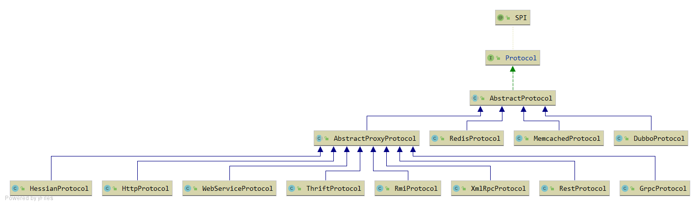

## Rpc: Dubbo如何进行Rpc调用。


### Invoker、Exporter
#### 接口
消费者和提供者都会使用到这个接口
1. 消费者将多个ExchangeClient封装为一个Invoker。 在调用Invoker.invoke时会向服务提供者发送请求。     
2. 在服务提供者端，会使用ProxyFactory将被代理对象封装为一个Invoker。在接收消费者的请求时，进行Invoker.invoke()调用，获得结果，并返回。      
```java
public interface Invoker<T> extends Node {
    /** 获取这个Invoker所代表的接口 **/
    Class<T> getInterface();
    /** 使用Invoker进行一个调用 **/
    Result invoke(Invocation invocation) throws RpcException;
}
```
只有提供者使用这个接口     
1. Protocol维护了一个ServiceKey，Exporter的Map。并在暴露服务时，将Invoker封装为Exporter, 并放入exporterMap中, 在接收请求时，根据url获得Exporter, 在得到Invoker.
```java
public interface Exporter<T> {
    /** 获取Invoker **/
    Invoker<T> getInvoker();

    void unexport();

}
```
#### 流程
##### 服务提供方
1. 有一个真正需要被调用的对象ref（Dubbo的@Service标注的类的对象），使用ProxyFactory.getInvoker，将ref封装为一个Invoker.
2. 将Invoker封装为Exporter。 在Protocol中维护了Map<String, Exporter<?>>。  key为URL。将Exporter放入Map中。
3. 在接收消费者的请求时，根据消费者的URL获取Exporter。 从Exporter中获取Invoker。调用invoke()函数。执行生成的动态代理对象。
4. 返回最后结果。

##### 服务消费方
1. 根据需要消费的URL, 使用Protocol.refer创建ExchangeClient。并将ExchangeClient封装为一个Invoker.
2. 使用ProxyFactory.getProxy()将Invoker封装为一个@Reference标注接口的实现类。
3. 之后用户便可以使用这个代理类进行远程调用。
/
### Protocol



#### 接口实现
```java
@SPI("dubbo")
public interface Protocol {
    /** 服务提供者： 将服务暴露出去 **/
    @Adaptive
    <T> Exporter<T> export(Invoker<T> invoker) throws RpcException;
    
    /** 服务消费放： 引用一个服务  **/
    @Adaptive
    <T> Invoker<T> refer(Class<T> type, URL url) throws RpcException;
}
```

#### DubboProtocol
##### 发布服务
###### export函数
除掉一些不重要的内容，剩下的是export函数的主要逻辑。
```java
    @Override
    public <T> Exporter<T> export(Invoker<T> invoker) throws RpcException {
        URL url = invoker.getUrl();
        // export service.
        String key = serviceKey(url);  // group/serverName:version:port
        DubboExporter<T> exporter = new DubboExporter<T>(invoker, key, exporterMap);   // 将Invoker封装为DubboExporter
        exporterMap.put(key, exporter);

        openServer(url);     // 启动ProtocolServer
        optimizeSerialization(url);

        return exporter;
    }
```
1. 从invoker获取url, 并从url中获取要调用服务的接口。
2. 将Invoker封装为Exporter。
3. 根据URL启动一个Server.
###### openServer函数
```java
private void openServer(URL url) {
        // find server.
        String key = url.getAddress();    // 注意这里是 ip:port
        //client can export a service which's only for server to invoke
        boolean isServer = url.getParameter(IS_SERVER_KEY, true);
        if (isServer) {                                 // 如果是Server端，才启动Server对象
            ProtocolServer server = serverMap.get(key);   // 没有监听这个地址，则监听这个地址。 双重检查锁，防止开启两个server, 一个地址只开启一个Server
            if (server == null) {
                synchronized (this) {
                    server = serverMap.get(key);
                    if (server == null) {
                        serverMap.put(key, createServer(url));     // 创建一个Server.
                    }
                }
            } else {
                // server supports reset, use together with override
                // 根据Url重置信息
                server.reset(url);
            }
        }
    }
```
1. 加锁， 相同的ip:port只能开启一个Server.
2. 使用createServer创建一个Server.
###### createServer函数
```java
// 打开服务端监听
    private ProtocolServer createServer(URL url) {
        url = URLBuilder.from(url)
                .addParameterIfAbsent(CHANNEL_READONLYEVENT_SENT_KEY, Boolean.TRUE.toString())
                .addParameterIfAbsent(HEARTBEAT_KEY, String.valueOf(DEFAULT_HEARTBEAT))
                .addParameter(CODEC_KEY, DubboCodec.NAME)
                .build();
        String str = url.getParameter(SERVER_KEY, DEFAULT_REMOTING_SERVER);

        ExchangeServer server = Exchangers.bind(url, requestHandler);   // 开启服务端： provider

        str = url.getParameter(CLIENT_KEY);
        if (str != null && str.length() > 0) {
            Set<String> supportedTypes = ExtensionLoader.getExtensionLoader(Transporter.class).getSupportedExtensions();
            if (!supportedTypes.contains(str)) {
                throw new RpcException("Unsupported client type: " + str);
            }
        }
        return new DubboProtocolServer(server);
    }
```
1. 使用Exchangers.bind开启一个Server

###### NettyServer.doOpen
```java 
@Override
    protected void doOpen() throws Throwable {
        bootstrap = new ServerBootstrap();

        bossGroup = NettyEventLoopFactory.eventLoopGroup(1, "NettyServerBoss");
        workerGroup = NettyEventLoopFactory.eventLoopGroup(
                getUrl().getPositiveParameter(IO_THREADS_KEY, Constants.DEFAULT_IO_THREADS),
                "NettyServerWorker");

        final NettyServerHandler nettyServerHandler = new NettyServerHandler(getUrl(), this);
        channels = nettyServerHandler.getChannels();

        bootstrap.group(bossGroup, workerGroup)
                .channel(NettyEventLoopFactory.serverSocketChannelClass())
                .option(ChannelOption.SO_REUSEADDR, Boolean.TRUE)
                .childOption(ChannelOption.TCP_NODELAY, Boolean.TRUE)
                .childOption(ChannelOption.ALLOCATOR, PooledByteBufAllocator.DEFAULT)
                .childHandler(new ChannelInitializer<SocketChannel>() {
                    @Override
                    protected void initChannel(SocketChannel ch) throws Exception {
                        // FIXME: should we use getTimeout()?
                        int idleTimeout = UrlUtils.getIdleTimeout(getUrl());
                        NettyCodecAdapter adapter = new NettyCodecAdapter(getCodec(), getUrl(), NettyServer.this);
                        if (getUrl().getParameter(SSL_ENABLED_KEY, false)) {
                            ch.pipeline().addLast("negotiation",
                                    SslHandlerInitializer.sslServerHandler(getUrl(), nettyServerHandler));
                        }
                        ch.pipeline()
                                .addLast("decoder", adapter.getDecoder())     
                                .addLast("encoder", adapter.getEncoder())     
                                .addLast("server-idle-handler", new IdleStateHandler(0, 0, idleTimeout, MILLISECONDS))   
                                .addLast("handler", nettyServerHandler);     
                    }
                });
        // bind
        ChannelFuture channelFuture = bootstrap.bind(getBindAddress());
        channelFuture.syncUninterruptibly();
        channel = channelFuture.channel();
    }
```
1. 使用Netty监听一个端口


##### 引用服务
###### refer
```java
    @Override
    public <T> Invoker<T> refer(Class<T> type, URL url) throws RpcException {
        return new AsyncToSyncInvoker<>(protocolBindingRefer(type, url));        // 异步转同步
    }
```

###### protocolBindingRefer
```java
    @Override
    public <T> Invoker<T> protocolBindingRefer(Class<T> serviceType, URL url) throws RpcException {
        optimizeSerialization(url);
        // create rpc invoker.
        // 消费端调用提供端的Invoker. 可以创建多个连接。
        // 这里就将所有的客户端都封装成了一个 Invoker. (这里只是一台机器的多个连接)
        DubboInvoker<T> invoker = new DubboInvoker<T>(serviceType, url, getClients(url), invokers);
        invokers.add(invoker);

        return invoker;
    }
```

###### getClients
```java
    // 获取客户端
    private ExchangeClient[] getClients(URL url) {
        // whether to share connection
        boolean useShareConnect = false;

        // 获取连接数和共享连接数
        int connections = url.getParameter(CONNECTIONS_KEY, 0);
        List<ReferenceCountExchangeClient> shareClients = null;
        // if not configured, connection is shared, otherwise, one connection for one service
        if (connections == 0) {
            useShareConnect = true;
            /*
             * The xml configuration should have a higher priority than properties.
             */
            String shareConnectionsStr = url.getParameter(SHARE_CONNECTIONS_KEY, (String) null);
            connections = Integer.parseInt(StringUtils.isBlank(shareConnectionsStr) ? ConfigUtils.getProperty(SHARE_CONNECTIONS_KEY,
                    DEFAULT_SHARE_CONNECTIONS) : shareConnectionsStr);
            shareClients = getSharedClient(url, connections);
        }

        ExchangeClient[] clients = new ExchangeClient[connections];
        for (int i = 0; i < clients.length; i++) {
            if (useShareConnect) {
                clients[i] = shareClients.get(i);
            } else {
                clients[i] = initClient(url);
            }
        }

        return clients;
    }
```

###### initClient
```java
 private ExchangeClient initClient(URL url) {
        // client type setting.
        String str = url.getParameter(CLIENT_KEY, url.getParameter(SERVER_KEY, DEFAULT_REMOTING_CLIENT));
        url = url.addParameter(CODEC_KEY, DubboCodec.NAME);
        // enable heartbeat by default
        url = url.addParameterIfAbsent(HEARTBEAT_KEY, String.valueOf(DEFAULT_HEARTBEAT));

        ExchangeClient client;
       // connection should be lazy
       if (url.getParameter(LAZY_CONNECT_KEY, false)) {
           client = new LazyConnectExchangeClient(url, requestHandler);     // 懒连接
       } else {
           client = Exchangers.connect(url, requestHandler);
       }


        return client;
    }
```

###### NettyClient.doOpen
```java
protected void doOpen() throws Throwable {
        final NettyClientHandler nettyClientHandler = new NettyClientHandler(getUrl(), this);
        bootstrap = new Bootstrap();
        bootstrap.group(NIO_EVENT_LOOP_GROUP)
                .option(ChannelOption.SO_KEEPALIVE, true)
                .option(ChannelOption.TCP_NODELAY, true)
                .option(ChannelOption.ALLOCATOR, PooledByteBufAllocator.DEFAULT)
                //.option(ChannelOption.CONNECT_TIMEOUT_MILLIS, getTimeout())
                .channel(socketChannelClass());

        bootstrap.option(ChannelOption.CONNECT_TIMEOUT_MILLIS, Math.max(3000, getConnectTimeout()));
        bootstrap.handler(new ChannelInitializer<SocketChannel>() {
            @Override
            protected void initChannel(SocketChannel ch) throws Exception {
                int heartbeatInterval = UrlUtils.getHeartbeat(getUrl());

                if (getUrl().getParameter(SSL_ENABLED_KEY, false)) {
                    ch.pipeline().addLast("negotiation", SslHandlerInitializer.sslClientHandler(getUrl(), nettyClientHandler));
                }

                NettyCodecAdapter adapter = new NettyCodecAdapter(getCodec(), getUrl(), NettyClient.this);
                ch.pipeline()//.addLast("logging",new LoggingHandler(LogLevel.INFO))//for debug
                        .addLast("decoder", adapter.getDecoder())
                        .addLast("encoder", adapter.getEncoder())
                        .addLast("client-idle-handler", new IdleStateHandler(heartbeatInterval, 0, 0, MILLISECONDS))   // 空闲处理器
                        .addLast("handler", nettyClientHandler);                                                       //
                // channel -> header -> decoder -> encoder -> client-idle-handler -> handler -> tail -> client                 // 对读入的消息进行处理
                // channel <- header <- decoder <- encoder <- client-idle-handler <- handler <- tail <- client                 // 对写出的消息进行处理

                String socksProxyHost = ConfigUtils.getProperty(SOCKS_PROXY_HOST);
                if(socksProxyHost != null) {
                    int socksProxyPort = Integer.parseInt(ConfigUtils.getProperty(SOCKS_PROXY_PORT, DEFAULT_SOCKS_PROXY_PORT));
                    Socks5ProxyHandler socks5ProxyHandler = new Socks5ProxyHandler(new InetSocketAddress(socksProxyHost, socksProxyPort));
                    ch.pipeline().addFirst(socks5ProxyHandler);
                }
            }
        });
    }
```

##### ChannelHandler
对接受的请求进行处理。
```java
    private ExchangeHandler requestHandler = new ExchangeHandlerAdapter() {
        @Override
        public CompletableFuture<Object> reply(ExchangeChannel channel, Object message) throws RemotingException {
            Invocation inv = (Invocation) message;
            Invoker<?> invoker = getInvoker(channel, inv);    // 从exportMap中取出Invoker
            // need to consider backward-compatibility if it's a callback
            // 如果是回调的话， 需要考虑兼容性
            if (Boolean.TRUE.toString().equals(inv.getObjectAttachments().get(IS_CALLBACK_SERVICE_INVOKE))) {
                String methodsStr = invoker.getUrl().getParameters().get("methods");
                boolean hasMethod = false;
                if (methodsStr == null || !methodsStr.contains(",")) {
                    hasMethod = inv.getMethodName().equals(methodsStr);
                } else {
                    String[] methods = methodsStr.split(",");
                    for (String method : methods) {
                        if (inv.getMethodName().equals(method)) {
                            hasMethod = true;
                            break;
                        }
                    }
                }
            }
            RpcContext.getContext().setRemoteAddress(channel.getRemoteAddress());
            Result result = invoker.invoke(inv);
            return result.thenApply(Function.identity());  // 仍然返回这个result， 但是异步的。
        }

        @Override
        public void received(Channel channel, Object message) throws RemotingException {
            if (message instanceof Invocation) {
                reply((ExchangeChannel) channel, message);

            } else {
                super.received(channel, message);
            }
        }
    };
```

```java
public class HeaderExchanger implements Exchanger {
    public static final String NAME = "header";
    @Override
    public ExchangeClient connect(URL url, ExchangeHandler handler) throws RemotingException {
        // ExChange 委托 Transport 进行通信
        return new HeaderExchangeClient(Transporters.connect(url, new DecodeHandler(new HeaderExchangeHandler(handler))), true);
    }
    @Override
    public ExchangeServer bind(URL url, ExchangeHandler handler) throws RemotingException {
        // ExChange 委托 Transport 进行通信
        return new HeaderExchangeServer(Transporters.bind(url, new DecodeHandler(new HeaderExchangeHandler(handler))));
    }
}
```
1. 在Netty接收到请求后，触发HeaderExchangeHandler。
```java
    public void received(Channel channel, Object message) throws RemotingException {
        final ExchangeChannel exchangeChannel = HeaderExchangeChannel.getOrAddChannel(channel);
        if (message instanceof Request) {         // 接收到请求
            // handle request.
            Request request = (Request) message;
            if (request.isTwoWay()) {
                handleRequest(exchangeChannel, request);
            } else {
                handler.received(exchangeChannel, request.getData());
            }
        }
    }
```
2. 如果是一个Request请求，并且是需要响应的，对该请求进行处理。handleRequest。
```java
    void handleRequest(final ExchangeChannel channel, Request req) throws RemotingException {
        Response res = new Response(req.getId(), req.getVersion());
        // find handler by message class.
        Object msg = req.getData();
        CompletionStage<Object> future = handler.reply(channel, msg); // 异步处理消息， 由上层决定如何处理消息，并返回结果。
        future.whenComplete((appResult, t) -> {  // appResult -> response , t -> throwable
            res.setStatus(Response.OK);
            res.setResult(appResult);
            channel.send(res);     // 返回结果
            
        });
    }
```
3. 对接收到的请求进行处理，并将返回值通过channel发送出去。

```java
    @Override
    public CompletableFuture<Object> reply(ExchangeChannel channel, Object message) throws RemotingException {
        Invocation inv = (Invocation) message;
        Invoker<?> invoker = getInvoker(channel, inv);    // 从exportMap中取出Invoker
        RpcContext.getContext().setRemoteAddress(channel.getRemoteAddress());
        Result result = invoker.invoke(inv);
        return result.thenApply(Function.identity());  // 仍然返回这个result， 但是异步的。
    }
```
4. 在第3步中的reply中，获取由ProxyFactory生成的Invoker. 会对@Service标注的类的对象进行调用。