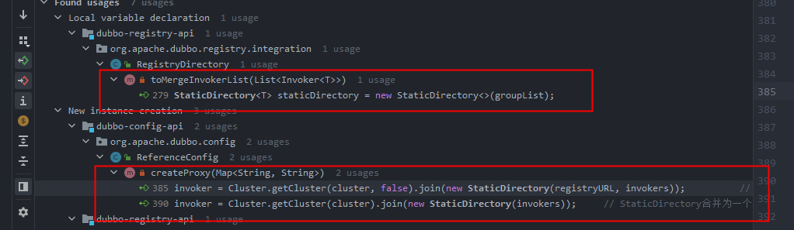

## Cluster


### 重要的四个接口
#### Cluster
集群容错接口，主要是当某些Provider节点发生故障时，
让Consumer节点的请求可以发送到正常的Provider节点上，
从而保证整个系统的可用性。

说的通俗点： Cluster通过join函数，把Directory集成到自己里面， 生成一个具有容错策略的Invoker。 后续对Invoker的调用，是对包装类ClusterInvoker的调用。

ClusterInvoker = Cluster.join(Directory);

ClusterInvoker.invoke()  中的真正干活的Invoker.invoke() 失败后， 会进行容错的策略，如重试等。


#### Directory
表示多个Invoker的集合，是后续路由规则、负载均衡策略、集群容错的基础。

说的通俗点： 所有与提供者连接的Invoker都在Directory中，通过Directory.list获取。


#### Router
请求经过Router的时候，会按照用户指定的规则匹配出符合条件的Provider.


#### LoadBalance
负载均衡接口，Consumer会按照指定的负载均衡策略，
从Provider集合中选出一个最合适的Provier节点来处理请求。
通俗说法： 会根据请求的URL上指定的负载均衡策略生成一个LoadBalance. 从经过Router过滤后的所有符合条件的Invoker中选择一个Invoker进行调用。


### 四个类如何配合使用
1. 创建Directory.   根据URL创建DynamicDirectory.  创建Directory的时候，会创建RouteChain。 
2. 创建Cluster（默认为FailoverCluster）.   使用 创建Cluster.join(directory) 返回一个AbstractClusterInvoker。 
3. 现在，ClusterInvoker中有了一个directory。  调用ClusterInvoker.invoke(),  会根据Invocation创建LoadBalance。 
4. 先使用directory返回所有的invoker, 根据router过滤掉不符合条件的invoker,  再根据LoadBalance选择一个Invoker。如果调用失败，再根据集群容错策略，进行相应的操作。 


#### Directory

##### StaticDirectory

只有两个地方用到。 
1. 在引用其他服务时，创建代理时，一种是直连服务，我们已经知道了所有的客户端连接，故使用StaticDirectory管理Invoker。 一种是多注册中心，使用StaticDirectory管理多个注册中心地址。
2. 在服务发现时，消费者感知到提供者发生变化，重新生成Invoker。 服务分组，同一个分组的Invoker由Cluster和StaticDirectory组合为一个Invoker。 

StaticDirectory不具有动态更新它所持有的Invoker列表的能力。


##### DynamicDirectory

DynamicDirectory有两个实现类： RegistryDirectory 和 ServiceDiscoveryRegistryDirectory。

我们先看RegistryDirectory。
###### RegistryDirectory
doList去掉次要逻辑后，逻辑看起来很简单，就是使用RouterChain.route(consumerUrl, invocation)过滤出符合条件的Invokers.a
```java
public List<Invoker<T>> doList(Invocation invocation) {
    List<Invoker<T>> invokers = null;
    invokers = routerChain.route(getConsumerUrl(), invocation);
    return invokers == null ? Collections.emptyList() : invokers;
}
```
好， 开始顺藤摸瓜，RouterChain中的Invoker是从下面这段代码来的。删除掉不重要的代码。 根据providerUrl生成Invoker, 并往routerChain中设值。
```java
    private void refreshInvoker(List<URL> invokerUrls) {
        // 将URL变为Invoker
        Map<URL, Invoker<T>> newUrlInvokerMap = toInvokers(invokerUrls);// Translate url list to Invoker map

        List<Invoker<T>> newInvokers = Collections.unmodifiableList(new ArrayList<>(newUrlInvokerMap.values()));
        routerChain.setInvokers(newInvokers);
        this.invokers = multiGroup ? toMergeInvokerList(newInvokers) : newInvokers;  // 相同分组的Invoker合并为一个Invoker
        this.urlInvokerMap = newUrlInvokerMap;

        try {
            destroyUnusedInvokers(oldUrlInvokerMap, newUrlInvokerMap); // Close the unused Invoker
        } catch (Exception e) {
            logger.warn("destroyUnusedInvokers error. ", e);
        }
    }
```
toInvokers()
```java

```