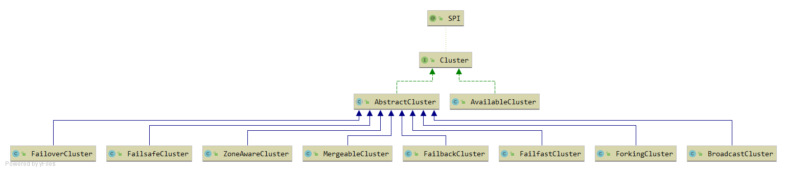
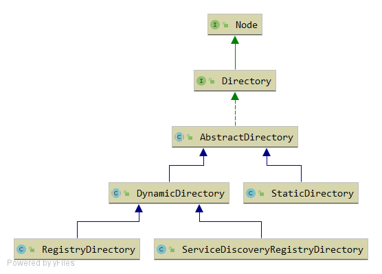
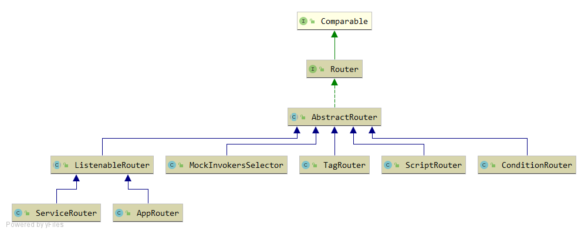
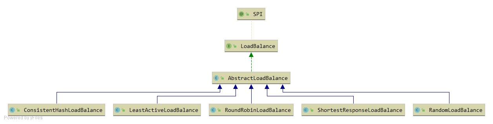
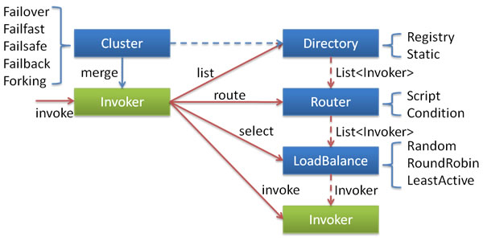

## Cluster

### Cluster
集群容错接口，主要是当某些Provider节点发生故障时，
让Consumer节点的请求可以发送到正常的Provider节点上，
从而保证整个系统的可用性。

### Directory
表示多个Invoker的集合，是后续路由规则、负载均衡策略、集群容错的基础。

### Router
请求经过Router的时候，会按照用户指定的规则匹配出符合条件的Provider.

### LoadBalance
负载均衡接口，Consumer会按照指定的负载均衡策略，
从Provider集合中选出一个最合适的Provier节点来处理请求。

#### 四个类如何配合使用

1. 创建Directory.   根据URL创建DynamicDirectory.  创建Directory的时候，会创建RouteChain。 
2. 创建Cluster（默认为FailoverCluster）.   使用 创建Cluster.join(directory) 返回一个AbstractClusterInvoker。 
3. 现在，ClusterInvoker中有了一个directory。  调用ClusterInvoker.invoke(),  会根据Invocation创建LoadBalance。 
4. 先使用directory返回所有的invoker, 根据router过滤掉不符合条件的invoker,  再根据LoadBalance选择一个Invoker。如果调用失败，再根据集群容错策略，进行相应的操作。 

