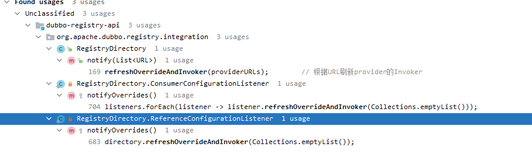

## Cluster


### 重要的四个接口
#### Cluster
集群容错接口，主要是当某些Provider节点发生故障时，
让Consumer节点的请求可以发送到正常的Provider节点上，
从而保证整个系统的可用性。

说的通俗点： Cluster通过join函数，把Directory集成到自己里面， 生成一个具有容错策略的Invoker。 后续对Invoker的调用，是对包装类ClusterInvoker的调用。

ClusterInvoker = Cluster.join(Directory);

ClusterInvoker.invoke()  中的真正干活的Invoker.invoke() 失败后， 会进行容错的策略，如重试等。


#### Directory
表示多个Invoker的集合，是后续路由规则、负载均衡策略、集群容错的基础。

说的通俗点： 所有与提供者连接的Invoker都在Directory中，通过Directory.list获取。


#### Router
请求经过Router的时候，会按照用户指定的规则匹配出符合条件的Provider.


#### LoadBalance
负载均衡接口，Consumer会按照指定的负载均衡策略，
从Provider集合中选出一个最合适的Provier节点来处理请求。
通俗说法： 会根据请求的URL上指定的负载均衡策略生成一个LoadBalance. 从经过Router过滤后的所有符合条件的Invoker中选择一个Invoker进行调用。


### 四个类如何配合使用
1. 创建Directory.   根据URL创建DynamicDirectory.  创建Directory的时候，会创建RouteChain。 
2. 创建Cluster（默认为FailoverCluster）.   使用 创建Cluster.join(directory) 返回一个AbstractClusterInvoker。 
3. 现在，ClusterInvoker中有了一个directory。  调用ClusterInvoker.invoke(),  会根据Invocation创建LoadBalance。 
4. 先使用directory返回所有的invoker, 根据router过滤掉不符合条件的invoker,  再根据LoadBalance选择一个Invoker。如果调用失败，再根据集群容错策略，进行相应的操作。 


#### Directory

##### StaticDirectory


只有两个地方用到。 
1. 在引用其他服务时，创建代理时，一种是直连服务，我们已经知道了所有的客户端连接，故使用StaticDirectory管理Invoker。 一种是多注册中心，使用StaticDirectory管理多个注册中心地址。
2. 在服务发现时，消费者感知到提供者发生变化，重新生成Invoker。 服务分组，同一个分组的Invoker由Cluster和StaticDirectory组合为一个Invoker。 

StaticDirectory不具有动态更新它所持有的Invoker列表的能力。


##### DynamicDirectory

DynamicDirectory有两个实现类： RegistryDirectory 和 ServiceDiscoveryRegistryDirectory。

我们先看RegistryDirectory。
###### RegistryDirectory
doList去掉次要逻辑后，逻辑看起来很简单，就是使用RouterChain.route(consumerUrl, invocation)过滤出符合条件的Invokers.a
```java
public List<Invoker<T>> doList(Invocation invocation) {
    List<Invoker<T>> invokers = null;
    invokers = routerChain.route(getConsumerUrl(), invocation);
    return invokers == null ? Collections.emptyList() : invokers;
}
```
好， 开始顺藤摸瓜，RouterChain中的Invoker是从下面这段代码来的。删除掉不重要的代码。 根据providerUrl生成Invoker, 并往routerChain中设值。
```java
    private void refreshInvoker(List<URL> invokerUrls) {
        // 将URL变为Invoker
        Map<URL, Invoker<T>> newUrlInvokerMap = toInvokers(invokerUrls);// Translate url list to Invoker map

        List<Invoker<T>> newInvokers = Collections.unmodifiableList(new ArrayList<>(newUrlInvokerMap.values()));
        routerChain.setInvokers(newInvokers);
        this.invokers = multiGroup ? toMergeInvokerList(newInvokers) : newInvokers;  // 相同分组的Invoker合并为一个Invoker
        this.urlInvokerMap = newUrlInvokerMap;

        try {
            destroyUnusedInvokers(oldUrlInvokerMap, newUrlInvokerMap); // Close the unused Invoker
        } catch (Exception e) {
            logger.warn("destroyUnusedInvokers error. ", e);
        }
    }
```
toInvokers将URL转换为Invoker.
```java
    private Map<URL, Invoker<T>> toInvokers(List<URL> urls) {
        Map<URL, Invoker<T>> newUrlInvokerMap = new HashMap<>();
        for (URL providerUrl : urls) {
            Invoker<T> invoker = localUrlInvokerMap == null ? null : localUrlInvokerMap.get(url);
            if (invoker == null) { // Not in the cache, refer again，  不在缓存中，再次引用
                // refer某个服务，建立client连接，然后进行一下包装。
                invoker = new InvokerDelegate<>(protocol.refer(serviceType, url), url, providerUrl);     // 最重要的一行。根据url进行服务引用。
                if (invoker != null) { // Put new invoker in cache
                    newUrlInvokerMap.put(url, invoker);            // 每一个URL都对应一个Invoker
                }
            } else {
                newUrlInvokerMap.put(url, invoker);
            }
        }
        keys.clear();
        return newUrlInvokerMap;
    }
```
好了，已经看完了将URL转换为Inovker. 那么URL哪里来的呢。  Alt + F7 可以查看哪里使用了这个函数。
```java
    private void refreshOverrideAndInvoker(List<URL> urls) {
        // mock zookeeper://xxx?mock=return null
        overrideConsumerUrl();
        refreshInvoker(urls);
    }
```
哪里使用这个函数呢？ 通过Find Usage 找到了三个地方使用了。 而且三个都是监听器。      


最重要的一个。
```java
    public synchronized void notify(List<URL> urls) {
        Map<String, List<URL>> categoryUrls = urls.stream()
                .filter(Objects::nonNull)
                .filter(this::isValidCategory)
                .filter(this::isNotCompatibleFor26x)
                .collect(Collectors.groupingBy(this::judgeCategory));  // 按照configurators、routers、providers进行分类

        List<URL> configuratorURLs = categoryUrls.getOrDefault(CONFIGURATORS_CATEGORY, Collections.emptyList()); // 获取configurators分类
        this.configurators = Configurator.toConfigurators(configuratorURLs).orElse(this.configurators);

        List<URL> routerURLs = categoryUrls.getOrDefault(ROUTERS_CATEGORY, Collections.emptyList());             // 获取routers分类
        toRouters(routerURLs).ifPresent(this::addRouters);

        // providers
        List<URL> providerURLs = categoryUrls.getOrDefault(PROVIDERS_CATEGORY, Collections.emptyList());         // 获取providers分类
        refreshOverrideAndInvoker(providerURLs);        // 根据URL刷新provider的Invoker
    }
```

###### 小结
DynamicDirectory会根据注册中心的通知，动态更新自己所持有的Invoker列表


#### Router

##### ConditionRouter
```java
/**
     * 基于条件表达式的路由规则，如：host = 10.20.153.10 => host = 10.20.153.11
     * 规则：
     * => 之前的为消费者匹配条件，所有参数和消费者的 URL 进行对比，当消费者满足匹配条件时，对该消费者执行后面的过滤规则。
     * => 之后为提供者地址列表的过滤条件，所有参数和提供者的 URL 进行对比，消费者最终只拿到过滤后的地址列表。
     * 如果匹配条件为空，表示对所有消费方应用，如：=> host != 10.20.153.11
     * 如果过滤条件为空，表示禁止访问，如：host = 10.20.153.10 =>
     */
    @Override
    public <T> List<Invoker<T>> route(List<Invoker<T>> invokers, URL url, Invocation invocation)
            throws RpcException {
        if (!matchWhen(url, invocation)) {            // 匹配不上，就返回所有Invoker
            return invokers;
        }
        List<Invoker<T>> result = new ArrayList<Invoker<T>>();
        if (thenCondition == null) {                  //  如果过滤条件为空，表示禁止访问，如：host = 10.20.153.10 =>
            return result;
        }
        for (Invoker<T> invoker : invokers) {
            if (matchThen(invoker.getUrl(), url)) {   // 消费应用匹配上了， 匹配提供者应用。
                result.add(invoker);
            }
        }
        if (!result.isEmpty()) {
            return result;
        } else if (force) {
            logger.warn("The route result is empty and force execute. consumer: " + NetUtils.getLocalHost() + ", service: " + url.getServiceKey() + ", router: " + url.getParameterAndDecoded(RULE_KEY));
            return result;
        }
        return invokers;
    }
```


#### LoadBalance

##### RandomLoadBalance
1. 随机，按权重设置随机概率。   
2. 在一个截面上碰撞的概率高，但调用量越大分布越均匀，而且按概率使用权重后也比较均匀，有利于动态调整提供者权重。  
```java
    protected <T> Invoker<T> doSelect(List<Invoker<T>> invokers, URL url, Invocation invocation) {
        // Number of invokers
        int length = invokers.size();
        // Every invoker has the same weight?
        boolean sameWeight = true;
        // the maxWeight of every invokers, the minWeight = 0 or the maxWeight of the last invoker
        int[] weights = new int[length];
        // The sum of weights
        int totalWeight = 0;
        for (int i = 0; i < length; i++) {
            int weight = getWeight(invokers.get(i), invocation);
            // Sum
            totalWeight += weight;
            // save for later use
            weights[i] = totalWeight;
            if (sameWeight && totalWeight != weight * (i + 1)) {
                sameWeight = false;
            }
        }
        if (totalWeight > 0 && !sameWeight) {
            // If (not every invoker has the same weight & at least one invoker's weight>0), select randomly based on totalWeight.
            int offset = ThreadLocalRandom.current().nextInt(totalWeight);
            // Return a invoker based on the random value.
            for (int i = 0; i < length; i++) {
                if (offset < weights[i]) {
                    return invokers.get(i);
                }
            }
        }
        // If all invokers have the same weight value or totalWeight=0, return evenly.
        return invokers.get(ThreadLocalRandom.current().nextInt(length));
    }
```


#### Cluster
##### FailfastCluster
```java
    public <T> AbstractClusterInvoker<T> doJoin(Directory<T> directory) throws RpcException {
        return new FailfastClusterInvoker<>(directory);
    }
```
##### FailfastClusterInvoker
```java
    @Override
    public Result doInvoke(Invocation invocation, List<Invoker<T>> invokers, LoadBalance loadbalance) throws RpcException {
        checkInvokers(invokers, invocation);
        Invoker<T> invoker = select(loadbalance, invocation, invokers, null);
        try {
            return invoker.invoke(invocation);
        } catch (Throwable e) {
            if (e instanceof RpcException && ((RpcException) e).isBiz()) { // biz exception.
                throw (RpcException) e;
            }
            throw new RpcException(e instanceof RpcException ? ((RpcException) e).getCode() : 0,
                    "Failfast invoke providers " + invoker.getUrl() + " " + loadbalance.getClass().getSimpleName()
                            + " select from all providers " + invokers + " for service " + getInterface().getName()
                            + " method " + invocation.getMethodName() + " on consumer " + NetUtils.getLocalHost()
                            + " use dubbo version " + Version.getVersion()
                            + ", but no luck to perform the invocation. Last error is: " + e.getMessage(),
                    e.getCause() != null ? e.getCause() : e);
        }
    }
```


#### 类配合使用的流程图
1. new Directory();                                                                    生成一个Directory
2. ClusterInvoker = Cluster.getCluster().join(directory)                               将directory注入到Cluster中，生成一个ClusterInvoker 
3. ClusterInvoker.invoke()                                                             ClusterInvoker.invoke()
5. List<Invoker<T>> invokers = list(invocation)                                        通过directory拿出所有可用的Invoker。
6. invokers = routerChain.route(getConsumerUrl(), invocation);                         directory使用router过滤掉不可用的Invoker.
6. LoadBalance loadbalance = initLoadBalance(invokers, invocation);                    根据Invocation获取选择的LoadBalance
7. doInvoke(invocation, invokers, loadbalance);                                        
8. Invoker<T> invoker = select(loadbalance, invocation, invokers, null);                使用负载均衡策略选择一个Invoker进行调用。
9. invoker.invoke