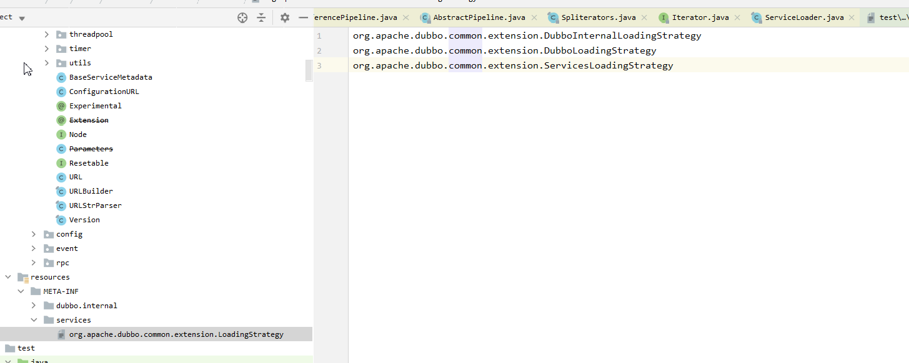

### SPI

#### 微内核架构
微内核架构中，内核通常采用Factory、IOC、OSGI等方式管理插件生命周期。

Dubbo才用SPI机制来加载插件。

#### JDK SPI

常见于Java的JDBC Driver。 

将具体的实现类放在ClassPath下的META-INF/services 目录下。


#### Dubbo SPI

Dubbo对配置文件进行了分类：
1. META-INF/services/ 目录： 兼容JDK SPI。
1. META-INF/dubbo/ 目录： 该目录用于存放用户自定义SPI配置文件。
1. META-INF/dubbo/internal/ 目录：用于存放Dubbo内部使用的SPI配置文件。

并且将配置文件改成了KV格式。 
其中key被称为扩展名，当我们在为一个接口寻找具体实现类时，可以指定扩展名来选择相应的扩展实现。    
这样就只需要实例化这一个扩展即可，无需实例化SPI配置文件中的其他扩展实现类。


#### @SPI

被@SPI修饰的接口， 就代表这个接口是扩展接口。   
@SPI注解中的value值，指定了默认的扩展名称。


#### ExtensionLoader如何处理SPI注解


#### 如何获取Dubbo对配置文件进行的分类
LoadingStrategy使用的是原生Java SPI机制进行加载。 




#### SPI的整个流程
1. ExtensionLoader<T> extensionLoader = ExtensionLoader.getExtensionLoader(T.class);
2. T adaptiveExtension = extensionLoader.getAdaptiveExtension();


经过上面两步即可获取到对应的扩展类。
但是获取的扩展类是自适应扩展类，即不是真正干活的类， 例如：
1. Compiler的自适应是AdaptiveCompiler, 
2. RegistryFactory的自适应扩展类是动态生成的，类名为RegistryFactory$Adaptive。 由AdaptiveClassCodeGenerator类的generate方法生成，由compiler编译，
   RegistryFactory$Adaptive类的内容为：
```java
package org.apache.dubbo.registry;

import org.apache.dubbo.common.extension.ExtensionLoader;

public class RegistryFactory$Adaptive
implements org.apache.dubbo.registry.RegistryFactory {

    public org.apache.dubbo.registry.Registry getRegistry(
            org.apache.dubbo.common.URL arg0
    ) {
        if (arg0 == null)
            throw new IllegalArgumentException("url == null");
        org.apache.dubbo.common.URL url = arg0;
        String extName = (url.getProtocol() == null ? "dubbo" : url.getProtocol());
        if (extName == null)
            throw new IllegalStateException(
                "Failed to get extension (org.apache.dubbo.registry.RegistryFactory) name from url (" +
                        url.toString() +
                        ") use keys([protocol])");
        org.apache.dubbo.registry.RegistryFactory extension = (org.apache.dubbo.registry.RegistryFactory) ExtensionLoader
                .getExtensionLoader(org.apache.dubbo.registry.RegistryFactory.class)
                .getExtension(extName);
        return extension.getRegistry(arg0);
    }
}
```

