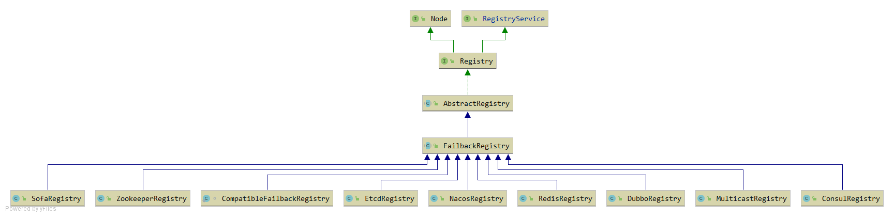
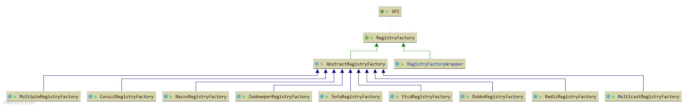

## 注册器

### 类结构

#### Registry类
* 功能： 实现注册、订阅等功能
##### Registry类图


从这个类图中， 可以看到Dubbo支持的所有的注册中心。有熟悉的zookeeper、redis、Nacos等。

#### RegistryFactory类（工厂模式）
我们使用double shift搜索org.apache.dubbo.registry.Registry发现没有对应的SPI文件， 是因为Registry是由RegistryFactory生成的，  
可以搜索org.apache.dubbo.registry.RegistryFactory，发现有很多RegistryFactory的SPI实现。


也就是说，在dubbo-registry包下的每个registry-api包的实现，既需要实现Registry,也要实现RegistryFactory。
##### RegistryFactory类图

##### wrapper类
在dubbo-registry-api类下有一个RegistryFactory的SPI文件, RegistryFactoryWrapper 是RegistryFactory的包装类。


Dubbo是如何判断一个类是否为另一个类的包装类。
ExtensionLoader.isWrapperClass();
```java
    private boolean isWrapperClass(Class<?> clazz) {
        try {
            clazz.getConstructor(type);
            return true;
        } catch (NoSuchMethodException e) {
            return false;
        }
    }
```
**RegistryFactoryWrapper（装饰器）**  
RegistryFactory中的getRegistry函数创建了一个包含实际工作的Registry和若干个RegistryServiceListener的ListenerRegistryWrapper。
```java
public class RegistryFactoryWrapper implements RegistryFactory {
    private RegistryFactory registryFactory;

    public RegistryFactoryWrapper(RegistryFactory registryFactory) {
        this.registryFactory = registryFactory;
    }

    @Override
    public Registry getRegistry(URL url) {
        return new ListenerRegistryWrapper(registryFactory.getRegistry(url),
                Collections.unmodifiableList(ExtensionLoader.getExtensionLoader(RegistryServiceListener.class)
                        .getActivateExtension(url, "registry.listeners")));
    }
}

```

#### RegistryServiceListener类

```java
public interface RegistryServiceListener {
    default void onRegister(URL url) { // 注册
    }
    default void onUnregister(URL url) { // 取消注册
    }
    default void onSubscribe(URL url) {  // 订阅
    }
    default void onUnsubscribe(URL url) { // 取消订阅
    }
}
```
##### RegistryFactory是如何调用Listener
```java
    @Override
    public void register(URL url) {
        try {
            registry.register(url);
        } finally {
            if (CollectionUtils.isNotEmpty(listeners)) {
                RuntimeException exception = null;
                for (RegistryServiceListener listener : listeners) {  // 遍历所有的Listener
                    if (listener != null) {
                        try {
                            listener.onRegister(url);
                        } catch (RuntimeException t) {
                            logger.error(t.getMessage(), t);
                            exception = t;
                        }
                    }
                }
                if (exception != null) {
                    throw exception;
                }
            }
        }
    }
```
其他的三个函数也是类似的。

#### RegistryFactory获取Registry的流程
1. RegistryFactory registryFactory = ExtensionLoader.getExtensionLoader(RegistryFactory.class).getAdaptiveExtension();
2. Registry registry = registryFactory.getRegistry(URL.valueOf("simple://localhost:8080/registry-service"));


1. 第一步，使用ExtensionLoader获取RegistryFactory, 其实得到的是自适应RegistryFactory。 因为RegistryFactory有一个Wrapper，最终得到的是RegistryFactoryWrapper。  
1.1 也就是说，客户端获取到的registryFactory的实际类型为RegistryFactoryWrapper。而RegistryFactoryWrapper中registryFactory是RegistryFactory$Adaptive（自适应类）。
2. 第二步，使用RegistryFactoryWrapper的getRegistry函数。会生成一个ListenerRegistryWrapper对象。传递进去的参数为真正工作的RegistroyFactory和RegistryServiceListener。
这样就可以实现对注册、订阅等操作的监听。


### 本地缓存


### 重试机制