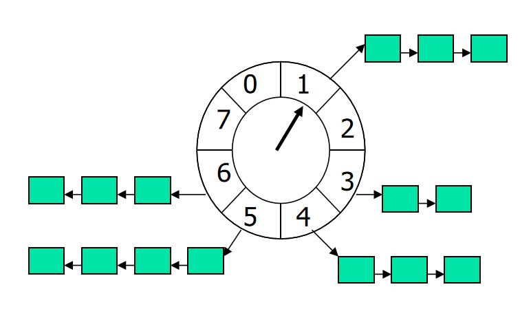
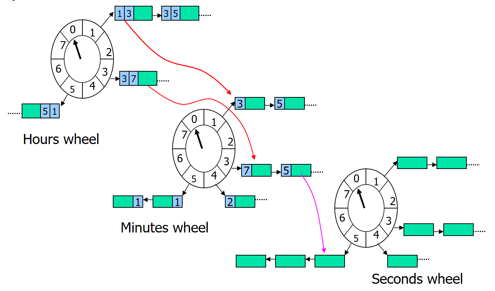

## HashedWheelTimer
时间轮的基本结构如下： 
#### 单层时间轮


#### 多层时间轮



### 基础
Dubbo使用的是单层时间轮。

#### Tick Duration
一个刻度所占用的时间，也就是刻度间隔
#### Wheel Size
一个时间轮的刻度数

#### HashedWheelTimeout
每个刻度上都是一个双向链表， 里面存放的就是延时任务

#### 轮数：remainingRounds
每个HashedWheelTimeout还有一个轮数，即这个时间轮，还需要转动几轮，才轮到自己执行任务。

#### 一轮的时间
TickDuration * WheelSize = 一轮的时间。

#### 表盘指针： tick
用于指向当前走到了哪个刻度。但是是单调递增的。 决定将任务放入哪个刻度时，会与WheelSize 进行 & 操作。就知道应该放入刻度。

### 实现
#### 构造函数
```java
    /**
     * Creates a new timer.
     *
     * @param threadFactory      a {@link ThreadFactory} that creates a
     *                           background {@link Thread} which is dedicated to
     *                           {@link TimerTask} execution.
     *                                                                        创建线程的工厂
     * @param tickDuration       the duration between tick                   一个刻度的时间间隔
     * @param unit               the time unit of the {@code tickDuration}   一个刻度的时间间隔单位
     * @param ticksPerWheel      the size of the wheel                       一个时间轮的刻度
     * @param maxPendingTimeouts The maximum number of pending timeouts after which call to
     *                           {@code newTimeout} will result in
     *                           {@link java.util.concurrent.RejectedExecutionException}
     *                           being thrown. No maximum pending timeouts limit is assumed if
     *                           this value is 0 or negative.
     *                           最多等待的任务， 如果小于等于0， 则无上限。
     * @throws NullPointerException     if either of {@code threadFactory} and {@code unit} is {@code null}
     * @throws IllegalArgumentException if either of {@code tickDuration} and {@code ticksPerWheel} is &lt;= 0
     */
    public HashedWheelTimer(
            ThreadFactory threadFactory,
            long tickDuration, TimeUnit unit, int ticksPerWheel,
            long maxPendingTimeouts) {

        if (threadFactory == null) {
            throw new NullPointerException("threadFactory");
        }
        if (unit == null) {
            throw new NullPointerException("unit");
        }
        if (tickDuration <= 0) {
            throw new IllegalArgumentException("tickDuration must be greater than 0: " + tickDuration);
        }
        if (ticksPerWheel <= 0) {
            throw new IllegalArgumentException("ticksPerWheel must be greater than 0: " + ticksPerWheel);
        }

        // Normalize ticksPerWheel to power of two and initialize the wheel.
        wheel = createWheel(ticksPerWheel);
        mask = wheel.length - 1;

        // Convert tickDuration to nanos.
        this.tickDuration = unit.toNanos(tickDuration);

        // Prevent overflow.  防止整个时间轮的时长大于 Long.MAX_VALUE 纳秒
        if (this.tickDuration >= Long.MAX_VALUE / wheel.length) {
            throw new IllegalArgumentException(String.format(
                    "tickDuration: %d (expected: 0 < tickDuration in nanos < %d",
                    tickDuration, Long.MAX_VALUE / wheel.length));
        }
        workerThread = threadFactory.newThread(worker);

        this.maxPendingTimeouts = maxPendingTimeouts;

        if (INSTANCE_COUNTER.incrementAndGet() > INSTANCE_COUNT_LIMIT &&
                WARNED_TOO_MANY_INSTANCES.compareAndSet(false, true)) {
            reportTooManyInstances();   // 防止太多实例影响程序的响应（每个实例都会有一个线程。）
        }
    }
```

#### 创建新的任务: newTimeout
```java
    public Timeout newTimeout(TimerTask task, long delay, TimeUnit unit) {
        if (task == null) {
            throw new NullPointerException("task");
        }
        if (unit == null) {
            throw new NullPointerException("unit");
        }

        long pendingTimeoutsCount = pendingTimeouts.incrementAndGet();  // 时间轮最大的等待任务

        if (maxPendingTimeouts > 0 && pendingTimeoutsCount > maxPendingTimeouts) {
            pendingTimeouts.decrementAndGet();
            throw new RejectedExecutionException("Number of pending timeouts ("
                    + pendingTimeoutsCount + ") is greater than or equal to maximum allowed pending "
                    + "timeouts (" + maxPendingTimeouts + ")");
        }

        start();

        // Add the timeout to the timeout queue which will be processed on the next tick.
        // During processing all the queued HashedWheelTimeouts will be added to the correct HashedWheelBucket.
        long deadline = System.nanoTime() + unit.toNanos(delay) - startTime;  // 任务需要执行的时刻相比startTime的纳秒数。  注意： System.nanoTime()和CPU时钟周期有关。只能用于做间隔时间的计算，不能用于表达时间.

        // Guard against overflow.
        if (delay > 0 && deadline < 0) {
            deadline = Long.MAX_VALUE;
        }
        HashedWheelTimeout timeout = new HashedWheelTimeout(this, task, deadline);
        timeouts.add(timeout);
        return timeout;
    }
```

#### Worker: 真正干活的
```java
private final class Worker implements Runnable {
        private final Set<Timeout> unprocessedTimeouts = new HashSet<Timeout>();

        private long tick;

        @Override
        public void run() {
            // Initialize the startTime.
            startTime = System.nanoTime();    // 系统当前时间
            if (startTime == 0) {
                // We use 0 as an indicator for the uninitialized value here, so make sure it's not 0 when initialized.
                // 0作为未初始化的标记， 当初始化了，确保它非0.
                startTime = 1;
            }

            // Notify the other threads waiting for the initialization at start().
            startTimeInitialized.countDown();         // 让 HashedWheelTimer.start() 向下执行

            // 循环执行任务
            do {
                final long deadline = waitForNextTick();   // 当前刻度的最后时间，在这个时间之前的任务都需要执行。
                if (deadline > 0) {
                    int idx = (int) (tick & mask);   // 该轮到wheel的那个bucket
                    processCancelledTasks();
                    HashedWheelBucket bucket =
                            wheel[idx];
                    transferTimeoutsToBuckets();
                    bucket.expireTimeouts(deadline);
                    tick++;
                }
            } while (WORKER_STATE_UPDATER.get(HashedWheelTimer.this) == WORKER_STATE_STARTED);

            // Fill the unprocessedTimeouts so we can return them from stop() method.
            for (HashedWheelBucket bucket : wheel) {
                bucket.clearTimeouts(unprocessedTimeouts);
            }
            for (; ; ) {
                HashedWheelTimeout timeout = timeouts.poll();
                if (timeout == null) {
                    break;
                }
                if (!timeout.isCancelled()) {
                    unprocessedTimeouts.add(timeout);
                }
            }
            processCancelledTasks();
        }

        private void transferTimeoutsToBuckets() {
            // transfer only max. 100000 timeouts per tick to prevent a thread to stale the workerThread when it just
            // adds new timeouts in a loop.
            for (int i = 0; i < 100000; i++) {
                HashedWheelTimeout timeout = timeouts.poll();
                if (timeout == null) {
                    // all processed
                    // 任务都执行完了
                    break;
                }
                if (timeout.state() == HashedWheelTimeout.ST_CANCELLED) {
                    // Was cancelled in the meantime.
                    // 任务被取消了
                    continue;
                }

                long calculated = timeout.deadline / tickDuration;             // 基于worker线程启动的时间，计算自己应该在那个刻度。
                timeout.remainingRounds = (calculated - tick) / wheel.length;  // 还剩多少轮， 才能执行到自己。

                // Ensure we don't schedule for past.
                final long ticks = Math.max(calculated, tick);                 // 防止calculated 比 tick 小。 （可能之前没执行到这个任务， 把上个刻度应该执行的任务，放到这个刻度来执行。）
                int stopIndex = (int) (ticks & mask);                          // 应该放到哪个bucket上。

                HashedWheelBucket bucket = wheel[stopIndex];
                bucket.addTimeout(timeout);
            }
        }

        private void processCancelledTasks() {
            for (; ; ) {
                HashedWheelTimeout timeout = cancelledTimeouts.poll();
                if (timeout == null) {
                    // all processed
                    break;
                }
                try {
                    timeout.remove();
                } catch (Throwable t) {
                    if (logger.isWarnEnabled()) {
                        logger.warn("An exception was thrown while process a cancellation task", t);
                    }
                }
            }
        }

        /**
         * calculate goal nanoTime from startTime and current tick number,
         * then wait until that goal has been reached.
         *
         * @return Long.MIN_VALUE if received a shutdown request,
         * current time otherwise (with Long.MIN_VALUE changed by +1)
         */
        private long waitForNextTick() {
            long deadline = tickDuration * (tick + 1);  // 计算当前刻度最后的时间

            for (; ; ) {
                final long currentTime = System.nanoTime() - startTime;
                long sleepTimeMs = (deadline - currentTime + 999999) / 1000000;  // 向上取整？

                if (sleepTimeMs <= 0) {
                    if (currentTime == Long.MIN_VALUE) {
                        return -Long.MAX_VALUE;
                    } else {
                        return currentTime;
                    }
                }
                if (isWindows()) {
                    sleepTimeMs = sleepTimeMs / 10 * 10;  // 取10的整数
                    // The granularity of sleeps is generally bound by the thread scheduler's interrupt period.
                    // In Linux, this interrupt period is generally 1ms in recent kernels (2.6.8 onwards).
                    // In Windows, the scheduler's interrupt period is normally around 10 or 15 milliseconds
                }

                try {
                    Thread.sleep(sleepTimeMs);         // 虽然这里sleep了， 但是每个刻度都需要这样来推动。
                } catch (InterruptedException ignored) {
                    if (WORKER_STATE_UPDATER.get(HashedWheelTimer.this) == WORKER_STATE_SHUTDOWN) {
                        return Long.MIN_VALUE;
                    }
                }
            }
        }

        Set<Timeout> unprocessedTimeouts() {
            return Collections.unmodifiableSet(unprocessedTimeouts);
        }
    }
```


### 总结
搞清楚了时间轮的整体结构，整个HashedWheelTimer的代码不难看懂。 
Dubbo的时间轮算法应该是直接将Netty中的时间轮代码实现Copy过来的。整个东西都是一样的。

### 和Kafka的时间轮实现对比
#### 层级
Dubbo的时间轮只有1级， 而kafka的时间轮有层级的概念。kafka的时间轮，更像是我们的手表上的表盘。 有多级时间轮。每个时间轮的刻度跨度和刻度数量均不一致。
还有刻度上的任务有降层级的概念。 
#### 刻度的推进
Dubbo使用每个刻度上的任务执行完后，都会休眠到下个刻度的开始时间。然后再开始下一轮任务的执行，周而复始。 
kafka则采用java中的DelayQueue来负责时间轮的推进。 Kafka 使用时间轮存储任务，使用DelayQueue负责时间的推进。
Kafka将每个使用到了的刻度都会存入到DelayQueue中，这样到了该 执行任务的刻度 时间，就从时间轮中取出任务执行。